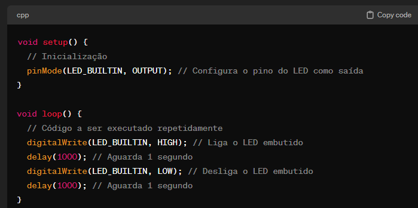
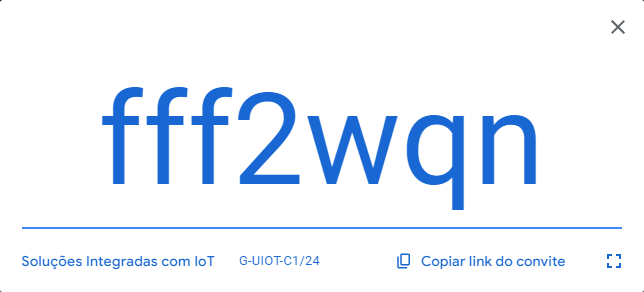
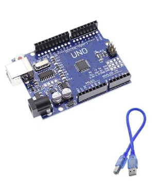
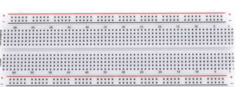
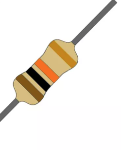
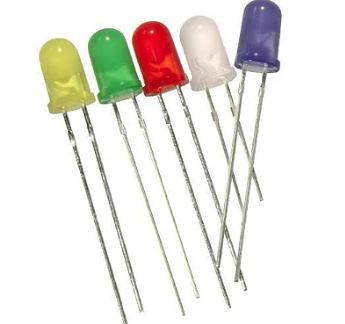
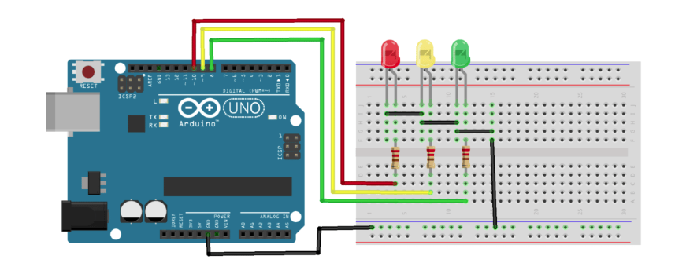

Objetivo do curso 
---

Aperfeiçõamento profissional de soluções integradas com IOT, desenvolvimento de competências relativas a implementação de soluções com tecnologias de IoT para a integracao de sistemas por meio de sensores, atuadores e aplicações de interface gráficas.

serão 40 horas de Curso em 10 encontros.

Trabalharei com aula explicativa, conceitos, e desenvolvimento de práticas pedagógicas de trabalho com programação e configuração de arduino, e sensores. Abordaremos conceitos de eletrônica de forma superficial para atingirmos os objetivos de criar projetos.
Comunição com cloud Hub IoT > Podemos contruir soluções IoT escalaveis e seguras, o serviço da azure cuida da complexidade associada à conectividade e ao gerenciamento dos dispositivos na IoT.

IoT > Internet of Things > Internet das Coisas é a forma de conectar objetos do nosso dia a dia à internet para que possam se comunicar entre si e conosco. 
Exemplo são os eletrodomésticos, carros, relógios, lampadas. Onde os mesmos são capazes de executarem tarefas automaticamente.

Você poderia controlar sua casa inteligente usando o smartphone, monitorar a geladeira remotamente para verificar temperatura, se algo esta faltando, etc. Receber alertas do carro referente a manutenções - Em resumo sera como dar inteligência aos objetos tornando-os mais eficientes e convenientes. 

IIOT
---
Industrial Internet of Things > Internet Industrial das coisas > è basicamente a aplicação do conceito de IoT no ambiente industrial. É conectar máquinas, equipamentos e processos industriais à internet para melhorar a eficiência, a produtividade e a tomada de decisao nas indústrias. Permitindo que as maquinas se comuniquem entre si e entre o sistema de gerenciamento, otimizando a produção e facilitando o monitoramento remoto. Torna as operações industriais mais inteligentes e conectadas.

O termo foi criado em 1999 por Kevin Ashton nesse momento ele utilizava a radiofrequencia RFID para a comunicacao entre dispositivos sem a necessidade de cabos.

Porem em 1982 uam maquina automatica de coca-cola foi conectada a ARPANET, ela foi modificada para ser capas de relatar seu inventário e se as bebidas recem recarregadas estavam frias ou não.

Atualmente com a criação dos smartphones, o surgimento da computação em nuvem, avanços no pode de processamento e algoritmos de software aprimorados, podemos coletar, armazenar, processar e compartilhar dados de formas mais robustas, além do uso de sensores sofsticados que são capazes de medir movimento, temperatura, niveis de umidade, direção de vento, som, luz, imagens, vibrações e inumeras outras condições, incluindo a capacidade de identificar pessoas ou um dispositivo por meio da geolocalização. 

Utilizaremos Arduido

Arduino 
---
é uma plataforma de prototipagem eletrônica de codigo aberto que permite a criação de projetos interativos e dispositivos eletetônicos forma acessivel.

Nivelamento
---
Linguagem C/C++

API 
 (Interface de Programação de Aplicações)
Uma API facilita a interação entre diferentes softwares, permitindo que eles "conversem" entre si de maneira eficiente e padronizada. Isso é essencial para a criação de aplicativos e serviços mais complexos, pois permite que diferentes partes de um sistema funcionem juntas de forma harmoniosa. Exemplo do garçom.

Classrom
---

1 - Todos tem cadastro no classroom ?
    se não providenciar com gmail e incluir os alunos na truma: 

 

    ou pelo link : 
    https://classroom.google.com/c/NjU5MDk5MTg1NzM4?cjc=fff2wqn
    
    
 Arduino
---

Protoboard ou breadboard
---

Resistores e Led
--- 

Com esses componentes ja podemos começar alguns projetos
---

Thinkercad
---
https://www.tinkercad.com/

