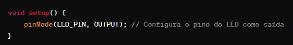

Quando se utiliza a biblioteca Arduino, o void setup() e o void loop() são funções fundamentais e têm papéis específicos:

void setup() (Configuração):
é chamada uma vez quando o programa começa a ser executado. É usada para realizar configurações iniciais, como a definição de pinos de entrada/saída, a inicialização de variáveis, ou qualquer outra tarefa que precise ser executada apenas uma vez no início do programa.

void loop() (Laço):
é executada continuamente em um loop depois que a função setup() é concluída. Tudo dentro desta função é repetido indefinidamente enquanto o Arduino estiver ligado. É aqui que você coloca o código para as operações principais do seu programa, como leitura de sensores, controle de dispositivos, decisões lógicas, etc.

Portanto, o void setup() é usado para configurar o ambiente inicial, enquanto o void loop() contém o código que será executado repetidamente em um ciclo contínuo.

Observação: É comum usar void antes de setup() e loop() para indicar que essas funções não retornam nenhum valor (void significa "vazio" em inglês). Quando se programa para Arduino, é importante seguir essa estrutura básica para que o código funcione corretamente.