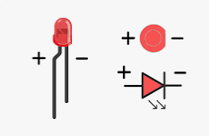

#Padroes em eletrônica
---
>Led polo positivo / polo negativo 

A haste (perna) maior do LED é o lado positivo e a menor é o lado negativo. Você pode ver também pelo lado mais achatado, que é o lado negativo enquanto o lado arredondado é o positivo.

>cores fios 

